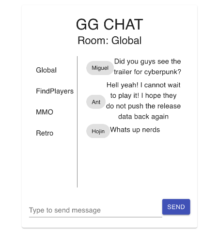

# socketio chat

<h4>
    </a>
    
    
        
</h4>

Descrption:

A messaging system using react. 

### Table of Contents
* [Description](#descripe)
* [License](#license)
* [Installation](#install)
* [Usage](#usage)
* [Contributing](#contributing)
* [Testing](#test)
* [Github](#github)
* [linkedin](#linked)

 
License:

None

Contributions:

Rutgers Bootcamp

Installation

Fork and add to React App

Usage

Global chat for react app

Contact Information:

Github

<a>https.//github.com/mi6gy</a>

LinkedIn

<a>https://www.linkedin.com/in/mjimenez1990</a>

email address

(mjimenez08@gmail.com)
